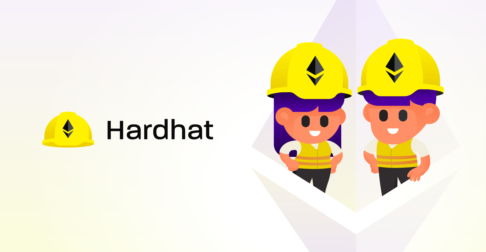

# Hardhat

Hardhat é um ambiente de desenvolvimento para compilar, implantar, testar e depurar seu software Ethereum. Ele ajuda os desenvolvedores a gerenciar e automatizar as tarefas recorrentes inerentes ao processo de criação de contratos inteligentes e dApps, além de introduzir facilmente mais funcionalidades nesse fluxo de trabalho. Isso significa compilar, executar e testar contratos inteligentes em seu núcleo.

## Running the code

Para criar uma infraestrutura de blockchain usando Hardhat, a primeira coisa a se fazer é instalar o Hardhat usando o comando:

```shell
mkdir hardhat
cd hardhat
npm init --yes
npm install --save-dev hardhat
```

Execute o hardhat usando o comando:

`npx hardhat`

Marque a opção de "Create a sample project"

Pronto infra configurada.

Agora, para criar contratos utilize a pasta Contracts para criar os arquivos .sol.

Após a criação de contratos, execute os comandos para compilar o contrato:

`npx hardhat compile`

Após o contrato compilado, pode iniciar os testes. Para isso use:

`npx hardhat test`

Para "deployar" o contrato, é preciso criar uma pasta script e dentro dela criar um arquivo .js para "instanciar" o contrato.

Para rodar o contrato em redes testnets, deve ser inserido a configuração no arquivo hardhat.config.js

Após isso execute:
`npx hardhat run scripts/deploy.js --network rinkeby`
